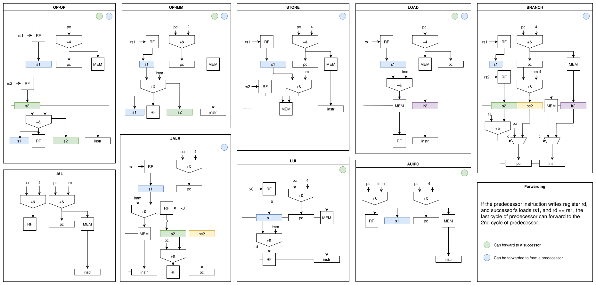

# suro-v

A tiny RISC-V processor that implements RV32I/E + Zicntr* + Zba. Uses a multi-cycle architecture where each instruction takes 1-3 cycles. Large shifts take additional cycles through a multi-stage shifter that can shift up to 3 bits per cycle. No interrupts or privilaged instructions.

Passes RISCV ISA tests rv32ui-p* and rv32uzba-p*.

Achives 0.591 DMIPS/MHz for I variant and 0.559 for E variant.

*Zicntr time returns cycle count, no higher-bit counters.

## Architecture

- **ISA**: RV32I + Zicntr (cycle counter only) + Zba. Fences are NOP.
- **Pipeline**: Multi-cycle, 1-3 cycles per instruction. Next instruction is prefetched during each instruction. 
- **Shifter**: Multi-stage, up to 3 bits per cycle. Right shifts take 1 extra cycle. All 3 kinds of shifts mux the same shifting circuit.
- **Adder** a single adder mux'ed for add/sub/compares, pc+imm and load/store offsets.

### Instruction Timing

| Operation Type | Cycles |
|----------------|--------|
| ALU (reg-reg)  | 3      |
| ALU (reg-imm)  | 2      |
| Load           | 3      |
| Store          | 2      |
| branch         | 3      |
| JAL            | 2      |
| JALR           | 3      |


## Performance

Quick PPA using openroad-flow-script nangate45.

| CPU | Area | fmax | DMIPS/MHz | P@fmax | P@100MHz |
|----- |----------|-------|-----------|---------------- | --- |
| surov | 0.015 | 750 | 0.591 | 27 | 3.9 |
| surov-e | 0.010 | 750 | 0.559 | 17 | 2.4 | 
| picorv32 | 0.020 | 1200 | 0.494 | 47 | 4.1 | 


## How to Run

```bash
cd hw/

make # verilator simulator
./Vsurov <path-to-bin-file> [bin-start e.g. 0x1000] [exe-start-address e.g. 0x1008]
# e.g.
./Vsurov ../sw/dhrystone.bin 0x100b4 0x121a8

make synth # run yosys + sta
```

The Systemverilog source is in hw/suro-v.2. The makefile can be used from hw/ directly.

The verilator testbench is in hw/tests/test_surov.cpp. To accommodate for rv32e, it uses a5 for syscall number.

Note it doesn't support CSRs (except cssr (m)cycle / (m)time / (m)instret). The start-up code in many embedded toolchains includes such instructions. sw/lib has an alternative (just run make inside) libmylib.a which has startup code, printf without libc initialization and syscalls (number on a5).


